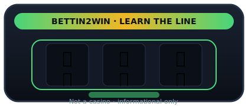
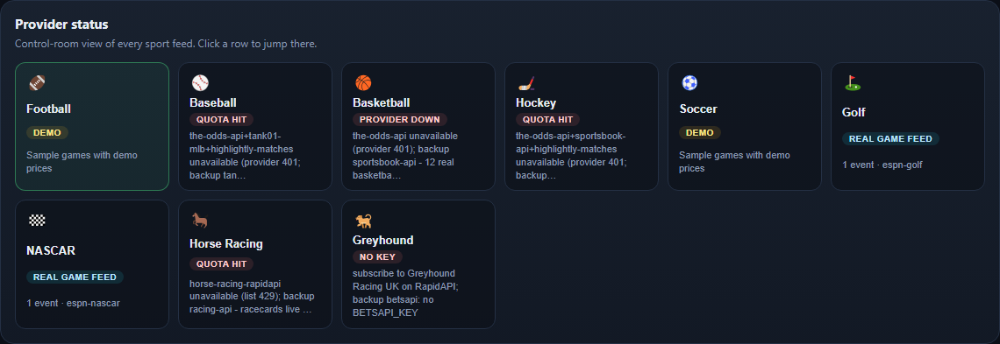
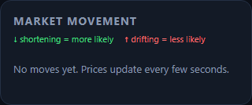
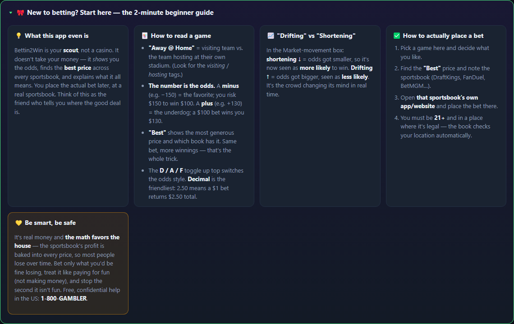

<p align="center">
  
</p>

# Bettin2Win

<p align="center">
  <a href="README.md"></a>
  <a href="README.es.md"></a>
  <a href="README.fr.md"></a>
  <a href="README.de.md"></a>
  <a href="README.pt-BR.md"></a>
  <a href="README.zh-CN.md"></a>
  <a href="README.ja.md"></a>
  <a href="README.ko.md"></a>
  <a href="README.it.md"></a>
  <a href="README.ar.md"></a>
</p>

<p align="center">
  
</p>

<p align="center">
  <a href="https://dacameragirl.github.io/Bettin2Win/"></a>
  <a href="https://bettin2win.onrender.com/health"></a>
</p>

**Le guide des cotes pour débutants — pas un bookmaker.** Comparez les lignes en direct,
traduisez les cotes en langage clair, calculez les gains possibles et comprenez chaque pari
avant de miser ailleurs. Football américain, baseball, basket, hockey, soccer, golf, NASCAR,
courses hippiques et lévriers.

Nous n'acceptons pas de paris. Usage informatif uniquement. Jouez responsablement.

> **Statut :** les fournisseurs en direct sont actifs. L'app tente d'abord les flux réels et ne
> bascule que si tous les fournisseurs d'un sport sont indisponibles, hors quota ou sans
> identifiants. Voir [État des fournisseurs](#état-des-fournisseurs).

## Points forts

| Fonction | Description |
|---|---|
| **Expliquer ce pari** | Bouton violet sur chaque carte — gains, probabilité implicite et conditions de victoire |
| **Comment fonctionne Bettin2Win** | Parcours en cinq étapes pour les nouveaux visiteurs |
| **Impact météo** | Badges pour matchs en plein air (vent, pluie, chaleur, piste) — contexte, pas de conseils |
| **Cartes basket** | Une carte par match avec onglets Moneyline / Spread / Total / Mouvement |
| **Filtres du tableau** | Débutants uniquement · matchs avec prix · matchs en direct · tout afficher |
| **Ticker marché** | Cotations indices et mega-cap via Yahoo Finance |
| **Pourquoi tout le monde n'est pas riche ?** | Explication favori/outsider/marge dans le guide et le panneau Expliquer |
| **État des fournisseurs** | Santé des flux en langage clair — vert quand les secours fonctionnent |
| **Mode démo** | Tableau d'exemple hors ligne pour explorer l'interface |

## Contenu du dépôt

Monorepo pnpm + Turborepo :

```text
apps/
  web/                Tableau de bord React + Vite
services/
  odds-engine/        Interroge les fournisseurs, normalise les cotes, détecte les mouvements
  ai-analyst/         Transforme les mouvements en insights en langage clair
packages/
  types/              Types de domaine partagés
.github/workflows/    CI, release, Pages et contrôles de santé
```

Chaque fournisseur est masqué derrière un adaptateur renvoyant la même forme `SportEvent`.

## Captures d'écran

App en ligne : [dacameragirl.github.io/Bettin2Win](https://dacameragirl.github.io/Bettin2Win/)








Régénérer : `pnpm screenshots` (Chromium via Playwright requis).

## Démarrage rapide

```bash
corepack enable
pnpm install
cp .env.example .env
pnpm dev
```

- Web : http://localhost:5173
- Moteur de cotes : http://localhost:4000
- Santé : http://localhost:4000/health

## État des fournisseurs

| Sport | Chaîne de fournisseurs | Auth | Comportement |
|---|---|---|---|
| Football US | The Odds API → Sportsbook API → **ESPN NFL** | `ODDS_API_KEY`, `RAPIDAPI_KEY` | Moneylines ESPN gratuits si quota The Odds API épuisé |
| Baseball | The Odds API → Tank01 MLB → **ESPN MLB** → MLB Stats | `ODDS_API_KEY`, `RAPIDAPI_KEY` | ESPN + MLB Stats maintiennent le tableau actif |
| Basket | The Odds API → Sportsbook API → **ESPN NBA** | `ODDS_API_KEY`, `RAPIDAPI_KEY` | Scores WNBA/NBA/universitaire + lignes DraftKings ESPN |
| Hockey | The Odds API → Sportsbook API → **ESPN NHL** → NHL scoreboard | `ODDS_API_KEY`, `RAPIDAPI_KEY` | Tableau NHL officiel fusionné avec prix ESPN |
| Soccer | BetMiner → football-prediction-api → **ESPN soccer** | `RAPIDAPI_KEY` | Prédictions + moneylines 3 issues gratuits ESPN |
| Golf | **ESPN golf** | aucune | Classement et tournois ESPN |
| NASCAR | **ESPN NASCAR** → TheRundown | `THERUNDOWN_API_KEY` (optionnel) | Classements ESPN ; TheRundown si clé |
| Courses | Horse Racing (RapidAPI) → The Racing API | `RAPIDAPI_KEY`, `RACING_API_USERNAME`, `RACING_API_PASSWORD` | Programmes + résultats ; budget tier gratuit |
| Lévriers | Greyhound Racing UK → **GBGB RSS** → BetsAPI | `RAPIDAPI_KEY`, `BETSAPI_KEY` | Secours RSS GBGB gratuit pour UK |

## Clés

Mettez les clés uniquement dans `.env` (git-ignored).

- The Odds API : `ODDS_API_KEY`
- RapidAPI : `RAPIDAPI_KEY`
- TheRundown : `THERUNDOWN_API_KEY`
- The Racing API : `RACING_API_USERNAME`, `RACING_API_PASSWORD`
- BetsAPI : `BETSAPI_KEY`

Si une clé a été collée dans un chat ou une capture, faites-la tourner.

## Scripts

| Commande | Action |
|---|---|
| `pnpm dev` | Lance apps/services en mode watch |
| `pnpm build` | Compile tout le monorepo |
| `pnpm typecheck` | Vérification des types |
| `pnpm test` | Tests unitaires |
| `pnpm screenshots` | Capture les captures du README |

## Contributeurs

- Angela — direction produit, fournisseurs, tests
- Claude — implémentation antérieure et workflow GitHub
- Dex (Codex) — secours fournisseurs, UI tableau de bord
- Grok — Impact météo, regroupement matchs, filtres, README et i18n

## Mentions légales

Application d'analyse/média, pas un bookmaker. Les conditions des fournisseurs varient ;
vérifiez leurs règles avant toute redistribution ou usage commercial.