<p align="center">
  
</p>

<p align="center">
  <strong>Real-time odds dashboard for the sports you follow — live lines, alerts, and research helpers.</strong>
</p>

<p align="center">
  <a href="https://dacameragirl.github.io/Bettin2Win/"></a>
  <a href="https://github.com/DaCameraGirl/Bettin2Win"></a>
</p>

<p align="center">
  
  
</p>

### Languages

<p align="center">
  
  
  
</p>

### Stack

<p align="center">
  
  
</p>

<p align="center">
  Built by <strong>Angela Hudson</strong> · <a href="https://github.com/DaCameraGirl">DaCameraGirl</a>
</p>
# Bettin2Win

<p align="center">
  <a href="README.md"></a>
  <a href="README.es.md"></a>
  <a href="README.fr.md"></a>
  <a href="README.de.md"></a>
  <a href="README.pt-BR.md"></a>
  <a href="README.zh-CN.md"></a>
  <a href="README.ja.md"></a>
  <a href="README.ko.md"></a>
  <a href="README.it.md"></a>
  <a href="README.ar.md"></a>
</p>

<p align="center">
  
</p>

<p align="center">
  <a href="https://dacameragirl.github.io/Bettin2Win/"></a>
  <a href="https://bettin2win.onrender.com/health"></a>
  
  
  
</p>

**The beginner's odds guide — not a sportsbook.** Compare live lines, translate odds into
plain English, calculate possible payouts, and learn what each bet means before you wager
elsewhere. Football, baseball, basketball, hockey, soccer, golf, NASCAR, horse racing, and
greyhounds.

We do not accept wagers. Informational use only. Bet responsibly.

> **Status:** live provider wiring is active. The app tries real feeds first and only falls
> back when every configured provider for that sport is unavailable, out of quota, or missing
> credentials. See [Provider status](#provider-status).

<p align="center"></p>
<p align="center"></p>


| Feature | What it does |
|---|---|
| **Explain this bet** | Purple CTA on every card — payouts, implied chance, and what must happen to win |
| **How Bettin2Win works** | Five-step journey strip for first-time visitors |
| **Weather Impact** | Outdoor game badges (wind, rain, heat, track) — context, not betting advice |
| **Basketball matchup cards** | One card per game with Moneyline / Spread / Total / Movement tabs |
| **Board filters** | Beginner-friendly only · games with prices · live games · show all |
| **Market ticker** | Live index & mega-cap quotes from Yahoo Finance |
| **Why isn't everyone rich?** | Favorite/underdog/margin explainer in the beginner guide + Explain panel |
| **Provider status** | Plain-English feed health — green when backups succeed |
| **Demo mode** | Offline sample board for exploring the UI |

<p align="center"></p>
<p align="center"></p>


A pnpm + Turborepo monorepo:

```text
apps/
  web/                React + Vite dashboard
services/
  odds-engine/        Polls providers, normalizes odds, detects movement, broadcasts snapshots
  ai-analyst/         Turns price movements into plain-language insights
packages/
  types/              Shared domain types every layer speaks
.github/workflows/    CI, release, Pages, and health checks
```

Every provider is hidden behind an adapter that returns the same normalized `SportEvent`
shape. The frontend never sees raw provider payloads, so adding or swapping a feed stays
inside the engine.

<p align="center"></p>
<p align="center"></p>


Live app: [dacameragirl.github.io/Bettin2Win](https://dacameragirl.github.io/Bettin2Win/)

### Dashboard

Main odds board with best-price comparison across sportsbooks (demo data shown here for a full board).


### Provider status

Control-room grid for every sport feed — live odds, real game data, demo, quota, or provider issues.


### Market movement

Shortening and drifting odds with plain-English hints in the right-hand feed.


### Beginner guide

Plain-English onboarding for first-time visitors, including responsible gambling copy.


Regenerate anytime: `pnpm screenshots` (requires Chromium via Playwright).

<p align="center"></p>
<p align="center"></p>


```bash
corepack enable
pnpm install
cp .env.example .env
pnpm dev
```

- Web app: http://localhost:5173
- Odds engine: http://localhost:4000
- Health check: http://localhost:4000/health

The desktop launcher created by `scripts/install-desktop-icon.ps1` starts the engine, starts
the web app, and opens the dashboard.

<p align="center"></p>
<p align="center"></p>


| Sport | Provider chain | Auth | Current behavior |
|---|---|---|---|
| Football | The Odds API → Sportsbook API → **ESPN NFL odds** | `ODDS_API_KEY`, `RAPIDAPI_KEY` | Free ESPN moneylines when The Odds API quota fails |
| Baseball | The Odds API → Tank01 MLB → **ESPN MLB odds** → MLB Stats | `ODDS_API_KEY`, `RAPIDAPI_KEY` | ESPN + MLB Stats keep boards green without paid keys |
| Basketball | The Odds API → Sportsbook API → **ESPN NBA odds** | `ODDS_API_KEY`, `RAPIDAPI_KEY` | WNBA/NBA/college scoreboards + DraftKings lines from ESPN |
| Hockey | The Odds API → Sportsbook API → **ESPN NHL odds** → NHL scoreboard | `ODDS_API_KEY`, `RAPIDAPI_KEY` | Official NHL scoreboard merged with ESPN prices |
| Soccer | BetMiner → football-prediction-api → **ESPN soccer odds** | `RAPIDAPI_KEY` | Predictions + free ESPN 3-way moneylines |
| Golf | **ESPN golf** | none | Leaderboard and tournament cards from ESPN |
| NASCAR | **ESPN NASCAR** → TheRundown | `THERUNDOWN_API_KEY` (optional) | ESPN race leaderboards; TheRundown when keyed |
| Horse racing | Horse Racing (RapidAPI) → The Racing API | `RAPIDAPI_KEY`, `RACING_API_USERNAME`, `RACING_API_PASSWORD` | Racecards + results; budgeted for free RapidAPI tier |
| Greyhound | Greyhound Racing UK → **GBGB RSS** → BetsAPI | `RAPIDAPI_KEY`, `BETSAPI_KEY` | Free GBGB RSS fallback for UK cards |

<p align="center"></p>
<p align="center"></p>


Put keys in `.env` only. The file is git-ignored and should not be committed.

- The Odds API: `ODDS_API_KEY`
- RapidAPI providers: `RAPIDAPI_KEY`
- TheRundown: `THERUNDOWN_API_KEY`
- The Racing API: `RACING_API_USERNAME`, `RACING_API_PASSWORD`
- BetsAPI: `BETSAPI_KEY`

If a key has ever been pasted into chat or screenshots, rotate it.

<p align="center"></p>
<p align="center"></p>


| Command | What it does |
|---|---|
| `pnpm dev` | Run all apps/services in watch mode |
| `pnpm build` | Build every package |
| `pnpm typecheck` | Type-check the monorepo |
| `pnpm test` | Run unit tests |
| `pnpm screenshots` | Capture README screenshots with Playwright |

<p align="center"></p>
<p align="center"></p>


- Angela — product direction, provider setup, testing
- Claude — prior implementation work and GitHub workflow
- Dex (Codex) — provider fallback fixes, dashboard UI, and repo maintenance
- Grok — Weather Impact, matchup grouping, board filters, README & i18n

<p align="center"></p>
<p align="center"></p>


This is an analytics/media app, not a bookmaker. Provider terms vary by plan and use case;
check each provider's rules before redistributing data or using it in a commercial betting
workflow.