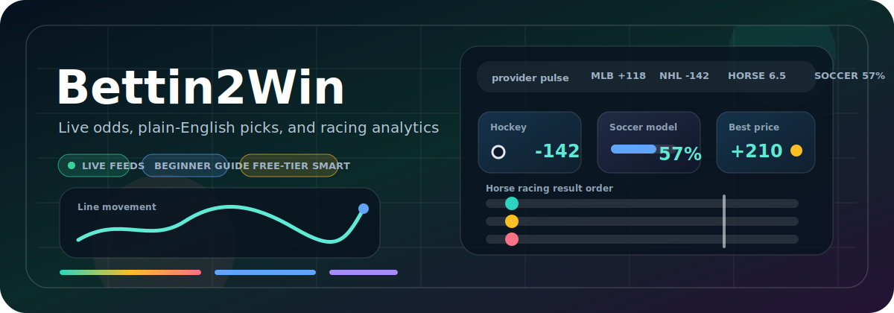
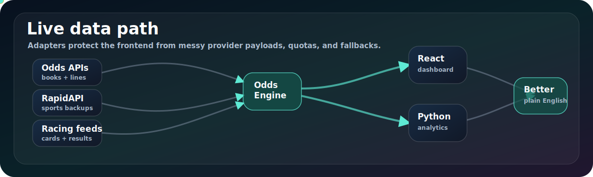

# Bettin2Win


Beginner-friendly, real-time multi-sport odds dashboard with plain-English
betting context for football, baseball, basketball, hockey, soccer, NASCAR,
horse racing, and greyhounds.

[Open Live Demo](https://dacameragirl.github.io/Bettin2Win/)

The public demo may show sample/fallback data when provider keys are not
configured.



> **Status:** live provider wiring is active. The app tries real feeds first and
> only falls back when every configured provider for that sport is unavailable,
> out of quota, or missing credentials. The dashboard can still run with zero
> keys by showing demo data until credentials are added.

> **Informational use only:** Bettin2Win does not place bets or guarantee
> outcomes. It explains odds movement and provider data for informational use.

## What users see

Bettin2Win helps users monitor live odds movement across multiple sports and
understand what changed in plain English, without needing to compare raw
sportsbook feeds manually.

In the dashboard, users see sport tabs, event cards, live/demo feed badges,
runner or team details, market movement, best-price context, and beginner-safe
explanations for what the numbers mean.

## What it does

- Watches real provider feeds for odds, schedules, scores, runners, and race
  results where the current free/available APIs support them.
- Normalizes every sport into the same shared `SportEvent` model so the web app
  does not need to know each provider's raw payload shape.
- Shows line movement, best-price context, beginner explanations, and sport
  cards built for quick scanning.
- Keeps API keys out of the frontend. The public web app talks to the hosted
  engine; secrets live only in local `.env` files or host environment variables.

## Languages and stack

GitHub's language bar is expected to show TypeScript, CSS, Python, PowerShell,
and a little HTML. Each one has a real job in this repo:



| Language / tool | Where it lives | What it owns |
|---|---|---|
| TypeScript | `apps/web`, `services/odds-engine`, `services/ai-analyst`, `packages/types` | React dashboard, Node/Express odds engine, WebSocket snapshots, AI-style explanations, shared domain types |
| CSS | `apps/web/src/styles.css` | Responsive dashboard layout, sport themes, cards, tabs, movement states, and animation polish |
| Python | `services/racing-analytics` | FastAPI + Pydantic horse-racing analytics, normalized racecards, derived form/rating features, pytest coverage |
| PowerShell | `scripts` | Windows desktop launcher and local convenience scripts |
| HTML | `apps/web/index.html` | Vite app shell for the React frontend |
| pnpm + Turborepo | repo root | Workspace installs, builds, tests, and package orchestration |

## Monorepo map

```text
apps/
  web/                React + Vite dashboard
services/
  odds-engine/        Polls providers, normalizes odds, detects movement, broadcasts snapshots
  ai-analyst/         Turns price movements into plain-language insights
  racing-analytics/  Python FastAPI service for horse-racing analytics
packages/
  types/              Shared domain types every layer speaks
scripts/              Windows launcher and setup helpers
.github/workflows/    CI, release, Pages, and health checks
```

Every provider is hidden behind an adapter that returns the same normalized
`SportEvent` shape. Adding or swapping a feed stays inside the engine instead
of leaking provider-specific fields into the frontend.



## Quick start

```bash
corepack enable
pnpm install
cp .env.example .env
pnpm dev
```

- Web app: http://localhost:5173
- Odds engine: http://localhost:4000
- Health check: http://localhost:4000/health

The desktop launcher created by `scripts/install-desktop-icon.ps1` starts the
engine, starts the web app, and opens the dashboard.

### Optional Python racing analytics

```bash
cd services/racing-analytics
python -m venv .venv
. .venv/Scripts/activate
pip install -r requirements-dev.txt
uvicorn app.main:app --reload --port 4100
```

- Racing health check: http://localhost:4100/health
- Racing Swagger docs: http://localhost:4100/docs

## Current status

- [x] Web dashboard scaffolded and deployed through GitHub Pages
- [x] Odds engine service running as the live data backend
- [x] Shared normalized `SportEvent` shape across frontend and services
- [x] Baseball odds fallback via Tank01 MLB
- [x] Horse racing finishing positions and odds via the budgeted RapidAPI feed
- [x] Provider fallback and movement tests
- [ ] NASCAR normalization in progress
- [ ] Greyhound provider normalization in progress; enabled when a valid key is present
- [ ] AI analyst explanation layer being expanded beyond templated explanations

## Portfolio notes

Bettin2Win demonstrates:

- Monorepo architecture with pnpm and Turborepo
- React + Vite frontend development
- Provider adapter design for external APIs
- Odds normalization across multiple sports
- Real-time update patterns through an odds engine service
- Plain-English explanation layer for market movement
- Safe informational-use framing for betting-related data

## Provider status

| Sport | Provider chain | Auth | Current behavior |
|---|---|---|---|
| Football | The Odds API -> Sportsbook API -> Highlightly matches | `ODDS_API_KEY`, `RAPIDAPI_KEY`, `HIGHLIGHTLY_API_KEY` | Real odds when available; real opportunities or match cards as backups |
| Baseball | The Odds API -> Tank01 MLB -> Highlightly matches | `ODDS_API_KEY`, `RAPIDAPI_KEY`, `HIGHLIGHTLY_API_KEY` | Tank01 supplies real MLB moneyline odds, books, and game times when The Odds API fails |
| Basketball | The Odds API -> Sportsbook API -> Highlightly matches | `ODDS_API_KEY`, `RAPIDAPI_KEY`, `HIGHLIGHTLY_API_KEY` | Real odds when available; Sportsbook API opportunities as backup |
| Hockey | The Odds API -> Sportsbook API -> Highlightly matches | `ODDS_API_KEY`, `RAPIDAPI_KEY`, `HIGHLIGHTLY_API_KEY` | Real odds/opportunities when providers have active hockey data |
| Soccer | BetMiner -> football-prediction-api | `RAPIDAPI_KEY` / `HIGHLIGHTLY_API_KEY` | Predictions, probability, correct score, form, and logos when quota allows |
| NASCAR | TheRundown | `THERUNDOWN_API_KEY` | Live credential check is wired; the UI stays on demo NASCAR cards until motorsport normalization lands |
| Horse racing | Horse Racing (RapidAPI) -> The Racing API | `RAPIDAPI_KEY`, `RACING_API_USERNAME` + `RACING_API_PASSWORD` | Real finishing positions and odds from the RapidAPI feed, cached and budgeted for the free roughly 50/day tier; The Racing API supplies racecards as a fallback |
| Greyhound | BetsAPI | `BETSAPI_KEY` | Live token check is wired; the UI stays on demo greyhound cards until event normalization lands |

## Keys

Put keys in `.env` only. The file is git-ignored and should not be committed.

- The Odds API: `ODDS_API_KEY`
- RapidAPI providers: `RAPIDAPI_KEY` and/or `HIGHLIGHTLY_API_KEY`
- TheRundown: `THERUNDOWN_API_KEY`
- The Racing API: `RACING_API_USERNAME`, `RACING_API_PASSWORD`
- BetsAPI: `BETSAPI_KEY`
- Optional AI provider: `AI_PROVIDER`, `AI_API_KEY`

If a key has ever been pasted into chat or screenshots, rotate it.

## Scripts

| Command | What it does |
|---|---|
| `pnpm dev` | Run all apps/services in watch mode |
| `pnpm build` | Build every package |
| `pnpm typecheck` | Type-check the monorepo |
| `pnpm test` | Run unit tests |
| `pnpm lint` | Run configured lint tasks; current packages use placeholder lint scripts |

Python racing analytics has its own checks:

```bash
cd services/racing-analytics
pytest
```

## Deploy

- Web dashboard: GitHub Pages at https://dacameragirl.github.io/Bettin2Win/
- Odds engine: Render web service from `render.yaml`
- Local and hosted engine expose `/health`; the dashboard connects to the engine
  over WebSocket for live snapshots.

See [DEPLOY.md](./DEPLOY.md) for the full Render + GitHub Pages setup.

## Contributors

- Angela - product direction, provider setup, testing
- Claude - prior implementation work and GitHub workflow
- Dex (Codex) - provider fallback fixes, dashboard UI, and repo maintenance

## Legal

This is an analytics/media app, not a bookmaker. Provider terms vary by plan and
use case; check each provider's rules before redistributing data or using it in
a commercial betting workflow.
